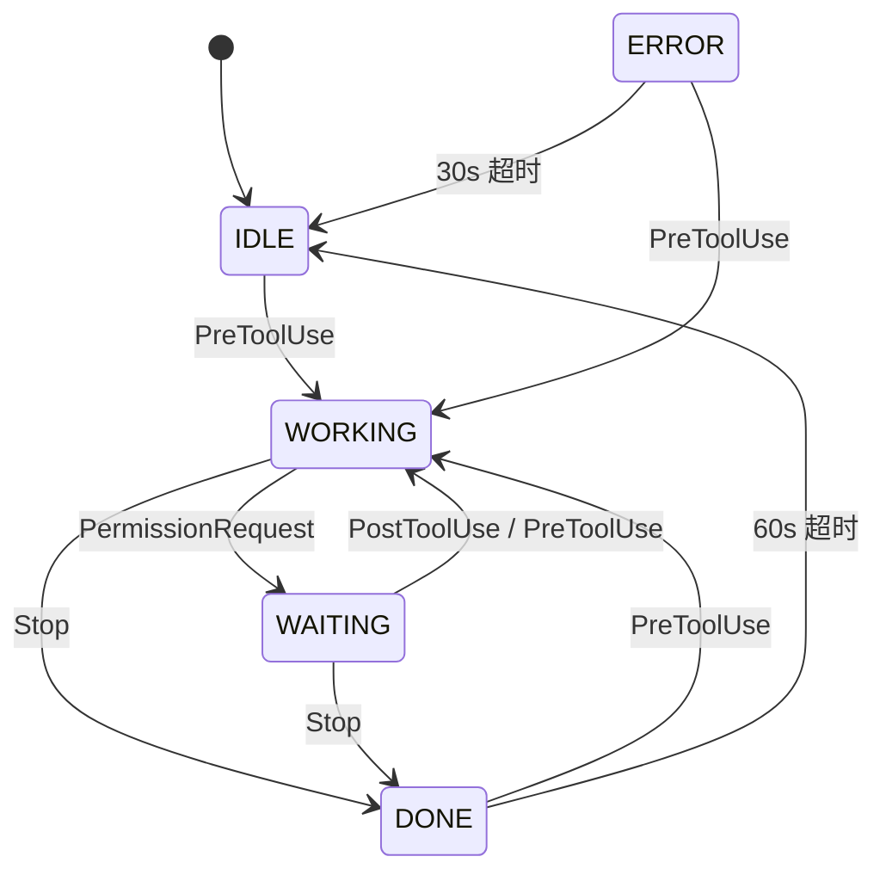

# ClaudeStatus

Claude Code CLI 桌面状态提示工具 — 系统托盘图标实时反映 Claude 工作状态，配合声音和桌面通知，让你不用反复切回终端检查进度。

**当前版本**: v0.1.0 | **平台**: Linux (Ubuntu 24.04) + Windows 10/11

> 架构设计和设计决策详见 [ARCHITECTURE.md](./ARCHITECTURE.md)。

## 功能

| 功能 | 说明 |
|------|------|
| 🟢🔴🟡⚫ **托盘变色** | 系统托盘 32×32 圆形图标：绿色=工作中，黄色=等待授权，红色=已完成，灰色=空闲 |
| 🖱️ **右击菜单** | 托盘图标右击显示状态菜单 + 退出选项 |
| 🔊 **提示音** | 任务完成和等待授权时播放不同提示音（WAV 内嵌，运行时无需外部文件） |
| 🔔 **桌面通知** | 非工作状态时弹出桌面通知，5 秒后自动消失，10 秒内同类型不重复 |
| 📦 **零运行时** | 单个二进制文件（~3.3MB），不需要 Node.js / Python / Java |

## 架构

```
┌─────────────────────────────────────────────────┐
│ Claude Code                                     │
│  PreToolUse / PostToolUse / Stop / PermissionReq │
│        │                                         │
│        │ echo '{"event":"done"}' | nc -U ...     │
│        ▼                                         │
├─────────────────────────────────────────────────┤
│ Unix Socket: /tmp/claude-status.sock             │
│ (Windows: Named Pipe \\.\pipe\claude-status)     │
├─────────────────────────────────────────────────┤
│             ClaudeStatus Daemon                  │
│                                                 │
│  IPC Listener ──► mpsc::channel ──► 状态机      │
│                                       │         │
│                          ┌────────────┼──────┐  │
│                          ▼            ▼      ▼  │
│                       托盘变色    播放音效  通知 │
└─────────────────────────────────────────────────┘
```

**设计原则**: Hook 脚本极简（一行 `echo`），守护进程负责全部状态管理和输出。IPC 通道解耦让未来扩展（手机推送、多 session）无需修改 Hook 配置。

## 快速开始

### Linux (Ubuntu 24.04)

**环境要求**: 桌面版 Wayland + GNOME 46。标准桌面安装已包含所有运行时依赖（D-Bus、libnotify、GTK3、PipeWire）。

#### 1. 获取二进制

从 [GitHub Releases](https://github.com/arisa/ClaudeStatus/releases) 下载：

```bash
curl -L -o claude-status https://github.com/arisa/ClaudeStatus/releases/latest/download/claude-status-linux-x86_64
chmod +x claude-status
```

#### 2. 安装 Hook + 启动

```bash
./claude-status install     # 配置 ~/.claude/settings.json hooks
# 重启 Claude Code session 使 hook 生效
./claude-status daemon &    # 启动守护进程
```

此时 GNOME 顶部栏右侧出现**灰色圆形图标**。右击图标可查看状态或退出。

#### 3. 手动测试

```bash
echo '{"event":"done"}'    | nc -w 1 -U /tmp/claude-status.sock   # 托盘变红 + 提示音
echo '{"event":"waiting"}' | nc -w 1 -U /tmp/claude-status.sock   # 托盘变黄 + 提示音
./claude-status status                                            # 查看当前状态
./claude-status quit                                              # 停止守护进程
```

### Windows 10/11

**环境要求**: 桌面版 Windows 10 1803+ 或 Windows 11。无需额外运行时。

#### 1. 获取二进制

从 [GitHub Releases](https://github.com/arisa/ClaudeStatus/releases) 下载两个文件：

```powershell
# claude-status.exe       — 守护进程（主程序）
# claude-status-send.exe  — IPC 发送器（Hook 脚本用）
```

将两个 exe 放在同一目录，并**加入 PATH**（或放在 Claude Code 能访问的固定路径）。

#### 2. 安装 Hook + 启动

```powershell
.\claude-status.exe install     # 配置 %USERPROFILE%\.claude\settings.json hooks
# 重启 Claude Code session 使 hook 生效
.\claude-status.exe daemon      # 启动守护进程
```

此时系统托盘（任务栏右侧 ▼ 展开区域）出现**灰色圆形图标**。右击图标可查看状态或退出。

#### 3. 手动测试

```powershell
.\claude-status-send.exe --event done     # 托盘变红 + 提示音
.\claude-status-send.exe --event waiting  # 托盘变黄 + 提示音
.\claude-status.exe status                # 查看当前状态
.\claude-status.exe quit                  # 停止守护进程
```

### 验证效果

| 你看到的 | 含义 |
|----------|------|
| 🟢 托盘变绿 | Claude 正在工作中 |
| 🟡 托盘变黄 + 提示音 + 通知 | Claude 在等你授权 |
| 🔴 托盘变红 + 提示音 + 通知 | Claude 已完成任务 |
| ⚫ 托盘变灰 | 空闲（60 秒无事件自动恢复） |

## CLI 参考

```
claude-status <子命令>
```

| 子命令 | 说明 | 参数 |
|--------|------|------|
| `daemon` | 启动后台守护进程 | `--verbose` 详细日志, `--log-file <路径>` |
| `quit` | 通过 IPC 发送退出命令 | — |
| `status` | 打印当前状态 (JSON) | `--watch` 每 2 秒刷新一次 |
| `install` | 自动配置 `~/.claude/settings.json` hooks | — |
| `uninstall` | 移除 hooks 配置 | — |

## 状态机

5 个状态，10 条转换规则，编译期穷举检查。



| 当前状态 | 触发事件 | 新状态 | 托盘 | 声音 | 通知 |
|----------|----------|--------|------|------|------|
| IDLE | `working` (PreToolUse) | WORKING | 🟢 绿 | — | — |
| WORKING | `done` (Stop) | DONE | 🔴 红 | done.wav | "Claude 已完成任务" |
| WORKING | `waiting` (PermissionRequest) | WAITING | 🟡 黄 | wating.wav | "Claude 正在等待你的操作" |
| WAITING | `resumed` / `working` | WORKING | 🟢 绿 | — | — |
| WAITING | `done` | DONE | 🔴 红 | done.wav | "Claude 已完成任务" |
| DONE | `working` | WORKING | 🟢 绿 | — | — |
| DONE | 60s 无事件 | IDLE | ⚫ 灰 | — | — |
| ERROR | `working` | WORKING | 🟢 绿 | — | — |
| ERROR | 30s 无事件 | IDLE | ⚫ 灰 | — | — |
| 任意 | 非法 JSON / 空消息 | 不变 | — | — | — |

## IPC 协议

**传输层**: Unix Domain Socket (`/tmp/claude-status.sock`)  
**协议**: 单行 JSON，`\n` 分隔  
**连接模式**: 短连接（每条消息独立连接）

### Hook 事件（Claude Code → Daemon）

```json
{"event": "working"}    // PreToolUse：Claude 开始工作
{"event": "resumed"}    // PostToolUse：用户已授权，继续工作
{"event": "done"}       // Stop：Claude 完成当前任务
{"event": "waiting"}    // PermissionRequest：Claude 等待用户授权
```

### 管理命令（CLI → Daemon）

```json
{"command": "quit"}     // 退出守护进程
```

### Hook 配置（`~/.claude/settings.json`）

安装 `claude-status install` 后自动生成。Linux 用 `nc`，Windows 用 `claude-status-send.exe`：

```jsonc
// Linux — nc 直接写 Unix Socket
{
  "hooks": {
    "PreToolUse": [{
      "type": "command",
      "command": "echo '{\"event\":\"working\"}' | nc -w 1 -U /tmp/claude-status.sock || true"
    }]
    // ... PostToolUse / Stop / PermissionRequest 同理
  }
}

// Windows — claude-status-send.exe 写 Named Pipe
{
  "hooks": {
    "PreToolUse": [{
      "type": "command",
      "command": "claude-status-send.exe --event working"
    }]
    // ... 同理
  }
}
```

`nc -w 1` 设置 1 秒超时，`|| true` 静默失败 —— 守护进程未运行时不影响 Claude Code 正常运行。

## 项目结构

```
claude-status/
├── README.md                      # 用户文档
├── ARCHITECTURE.md                # 架构设计与技术决策
├── Cargo.toml                     # workspace 根（2 个成员）
├── claude-status/                 # 守护进程（主程序）
│   ├── Cargo.toml                 # 14 个依赖
│   └── src/
│       ├── main.rs                # CLI + 守护进程事件循环
│       ├── state.rs               # 状态机（5 状态, 10 转换, 21 tests）
│       ├── ipc.rs                 # Unix Socket / Named Pipe listener (10 tests)
│       ├── tray.rs                # 系统托盘（圆形 PNG 内嵌）
│       ├── sound.rs               # 音频播放（rodio, WAV 内嵌）
│       ├── notify.rs              # 桌面通知（notify-rust, 10s 限频）
│       ├── install.rs             # Hook 安装/卸载（Linux nc / Win send）
│       ├── config.rs              # 日志（env_logger）
│       └── platform.rs            # Linux/Windows 条件编译
├── claude-status-send/            # IPC 发送器（小型 helper）
│   ├── Cargo.toml                 # 3 个依赖（~460KB）
│   └── src/
│       └── main.rs                # --event / --command → IPC 写入
├── assets/
│   ├── idle.png                   # 空闲图标（灰色圆形, 32×32）
│   ├── working.png                # 工作中图标（绿色圆形）
│   ├── done.png                   # 已完成图标（红色圆形）
│   ├── waiting.png                # 等待图标（黄色圆形）
│   ├── done.wav                   # 完成提示音（229KB）
│   └── wating.wav                 # 等待提示音（319KB）
└── .github/workflows/
    ├── ci.yml                     # Linux + Windows 双平台 CI
    └── release.yml                # tag push → GitHub Release
```

## 技术栈

| 组件 | Crate | 版本 |
|------|-------|------|
| CLI 解析 | `clap` (derive) | 4 |
| IPC 通信 | `interprocess` | 2 |
| 系统托盘 | `tray-icon` | 0.19 |
| 桌面通知 | `notify-rust` | 4 |
| 音频播放 | `rodio` | 0.20 |
| JSON | `serde` + `serde_json` | 1 |
| 图标解码 | `png` | 0.17 |
| 错误处理 | `anyhow` | 1 |
| 日志 | `log` + `env_logger` | 0.4 / 0.11 |
| Linux GTK | `gtk` | 0.18 |
| Win32 消息泵 | `windows-sys` | 0.59 |

**并发模型**: 同步 `std::thread` + `mpsc::channel`（事件量低，无需 tokio）  
**错误策略**: `anyhow` 全项目统一，音频播放 `catch_unwind` 容错静默降级  
**平台抽象**: `platform.rs` 集中管理 `#[cfg(target_os)]` 差异

## 系统要求

### Linux (Ubuntu 24.04)

| 组件 | 状态 | 备注 |
|------|------|------|
| D-Bus / libdbus | 桌面版预装 | tray-icon 和 notify-rust 依赖 |
| libnotify | 桌面版预装 | 桌面通知 |
| PipeWire / PulseAudio | 桌面版预装 | 音频播放 |
| GTK 3 | 桌面版预装 | tray-icon 的 Linux 后端 |
| `netcat-openbsd` | 桌面版预装 | Hook 脚本用 `nc` 写入 IPC |
| `gnome-shell-extension-appindicator` | Ubuntu 桌面版预装 | GNOME 45+ 托盘图标支持 |

**已知限制**:
- 纯 SSH 会话（无图形桌面）无法使用托盘和通知，这是预期行为
- Wayland + GNOME 46/47 需要 `appindicator` 扩展（Ubuntu 24.04 已预装 `ubuntu-appindicators@ubuntu.com`）
- 最小服务器安装可能缺少 libnotify 和 GTK，需要手动 `apt install`

### Windows 10/11

| 组件 | 状态 | 备注 |
|------|------|------|
| Win32 Shell API | 预装 | 系统托盘 Shell_NotifyIcon |
| WinRT Notifications | 预装 | 桌面通知 |
| WASAPI | 预装 | 音频播放 |
| Named Pipe | 预装 | IPC 通信（`\\.\pipe\claude-status`） |

**已知限制**:
- Windows Server Core（无桌面体验）无法使用托盘和通知
- `claude-status-send.exe` 必须在 PATH 中或与 daemon 同目录（Hook 脚本找得到即可）

## 开发

```bash
# 运行测试（21 个单元测试）
cargo test

# 编译检查（最快）
cargo check

# 调试模式运行
RUST_LOG=debug cargo run -- daemon --verbose

# Release 编译
cargo build --release
# → target/release/claude-status (约 3.3MB)
```

## 许可

MIT

---

**项目状态**: v0.1.0 核心功能完成，Linux 端到端验证通过。Windows 适配和集成测试开发中。
